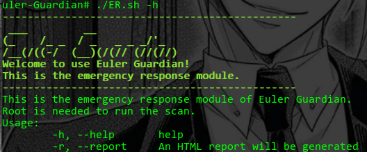

# Euler Guardian

Euler Guardian: generic Linux operating system risk assessment tool for openEuler community

gitee：
https://gitee.com/openeuler-competition/summer2021-110


<!-- vim-markdown-toc GFM -->

* [Configuration](#configuration)
* [color in CLI](#color-in-cli)
* [front end](#front-end)
* [Module](#module)
	* [local scan module](#local-scan-module)
		* [PreOp](#preop)
		* [SysInfoChk](#sysinfochk)
		* [SecCheck](#seccheck)
		* [UserInfoChk](#userinfochk)
		* [UserIdenChk](#useridenchk)
		* [FileChk](#filechk)
		* [AuditChk](#auditchk)
		* [OVALChk](#ovalchk)
		* [SendEmail](#sendemail)
	* [ER emergency response module](#er-emergency-response-module)
		* [BasicCheck](#basiccheck)
		* [SensitiveFileCheck](#sensitivefilecheck)
		* [FilesChanged](#fileschanged)
		* [ProcAnalyse](#procanalyse)
		* [HiddenProc](#hiddenproc)
		* [HistoryCheck](#historycheck)
		* [UserAnalyse](#useranalyse)
		* [CronCheck](#croncheck)
		* [WebshellCheck](#webshellcheck)
* [Reference](#reference)

<!-- vim-markdown-toc -->

## Configuration

Firstly, finish configuration before using.

This configuration is not obliged if you only use emergency response module.

1. run config.sh

```bash
chmod +x config.sh
su
./config.sh
```

2. Config ssmtp

This configuration is not obliged when you do not send emails to inform users.

```bash
vi /etc/ssmtp/ssmtp.conf # root privilidge is needed
```

Change the file like this

```
root=username@gmail.com
mailhub=smtp.gmail.com:465
rewriteDomain=gmail.com
AuthUser=username
AuthPass=authcode
FromLineOverride=YES
UseTLS=YES
```

**Notice: When sending an email, the fromAddr should be the address you set in configuration**

## color in CLI

|color|info|
|---|---|
|blue| process display|
|default|information display|
|green|normal|
|yellow|low risk|
|red|high risk|
|purple|suggestion to repair|

## front end

Normalize CSS from:

https://necolas.github.io/normalize.css/8.0.1/normalize.css

## Module

### local scan module

This module should be run as root. Reports will be generated after scanning.

```
Usage:
	-h	 help
	-f	 sender email addr
	-t	 receiver email addr
```

There are 4 reports generated in total.

1. The summary of scan results, in format of charts. Click hyperlinks to see detailed information.


2. Detailed information. Detailed information of all scan results. (With anchor)


3. Secure configuration report


4. CVE report


#### PreOp

Pre operations

1. check current id, should be run as root

2. check SetUID

3. delete s.txt left by the previous scan if there is any

#### SysInfoChk

System information check.

#### SecCheck

Security policy check.

1. if SELinux is Used

2. Limitation of resources


#### UserInfoChk

Check user information


1. hostname

2. id

3. if passwords are stored as hash

4. last login users

#### UserIdenChk

Password configuration


1. Days for a password to expire: PASS_MAX_DAYS

2. Min days to wait after last change of password: PASS_MIN_DAYS

3. Min length of password: PASS_MIN_LEN

4. Days to receive warning before password expiration: PASS_WARN_AGE

5. Days password has been used (to do)

6. PAM Cracklib provides with the ability to control complexity of password.

**password**: password complexity policy

(Usually N < 0)

|option|information|
|---|---|
|retry|retry times|
|difok|character changes in the new password that differentiate it from the old password|
|minlen|The minimum acceptable size for the new password|
|ucredit|(N >= 0) the maximum credit for having upper case letters in the new password
(N < 0) the minimum number of upper case letters in a new password.|
|lcredit|(N >= 0) the maximum credit for having lower case letters in the new password
(N < 0) the minimum number of lower case letters in a new password|
|dcredit|(N >= 0) the maximum credit for having digits in the new password
(N < 0) the minimum number of digits in a new password|
|dictpath|Path to the cracklib dictionaries|

7. Check users without password

#### FileChk

File check


1. Search for all the files in the OS with s perm

2. Search for files having 777 perm without group belonged to

3. Search for orphan files

4. unusual modules loaded to kernel

#### AuditChk

Linux Auditing System

For CentOS etc: audit, audit-libs

Fpr debian etc: auditd

Security reinforce for openEuler OS: (to do)

https://docs.openeuler.org/zh/docs/20.03_LTS/docs/SecHarden/%E6%93%8D%E4%BD%9C%E7%B3%BB%E7%BB%9F%E5%8A%A0%E5%9B%BA%E6%A6%82%E8%BF%B0.html

https://docs.openeuler.org/zh/docs/20.03_LTS/docs/SecHarden/%E5%AE%89%E5%85%A8%E5%8A%A0%E5%9B%BA%E5%B7%A5%E5%85%B7.html

#### OVALChk

Using OVAL files and oscap, scan secure configuration and CVEs of the OS.

SSG database from:

https://github.com/ComplianceAsCode/content

https://oval.cisecurity.org/repository/download

https://security-metadata.canonical.com

https://www.redhat.com/security/data/oval/v2/

#### SendEmail

Send email to user.


### ER emergency response module

Automatical emergency response after intrusion

An HTML report can be generated according to the scan results.



The report will be in the format of chart


#### BasicCheck

Basic check


1. iptables: firewall rules

2. open TCP and UDP ports

3. init.d services

4. `$PATH`

#### SensitiveFileCheck

unusual modules loaded to kernel


tmpArr[]:

|0|1|2|
|---|---|---|
|Module|Size|Used by|

#### FilesChanged

Check changed files


1. files that are opened but deleted (except browser)

|0|1|2|3|4|5|6|7|8|9|
|---|---|---|---|---|---|---|---|---|---|
|COMMAND|PID|USER|FD|TYPE|DEVICE|SIZE/OFF|NLINK|NODE|NAME|

2. files changed in 7 days

- atime: Access timestamp, which indicates the last time a file was accessed.

- ctime : Change timestamp, which refers to the last time some metadata related to the file was changed.

- mtime: Modified timestamp, which is the last time a file's contents were modified.

#### ProcAnalyse

If there are processes using CPU more than n%


#### HiddenProc

Check hidden processes and sort

#### HistoryCheck


1. Check `wget` in history

2. Check `ssh` in history

3. Check ssh brute-force as root

#### UserAnalyse


1. If `root` is the only root user

2. Users without passwords

3. Users that are able to login

4. Last login of all users

#### CronCheck


1. crontab files of root

2. cron backdoor

#### WebshellCheck


Webshell check based on files, supporting php, asp and jsp

## Reference

- [Lynis](https://cisofy.com/documentation/lynis/)
- [Vulmap](https://github.com/vulmon/Vulmap)
- [Nix Auditor](https://github.com/XalfiE/Nix-Auditor)
- [GScan](https://github.com/grayddq/GScan)
- wooyun: Linux服务器应急事件溯源报告
- 黑客入侵应急分析手工排查
- 安恒: 勒索病毒应急与响应手册
- 绿盟: 应急响应技术指南
- 等保2.0: GBT25070-2019信息安全技术网络安全等级保护安全设计技术要求
- Minimum Security Requirements for Multi-User Operating Systems
