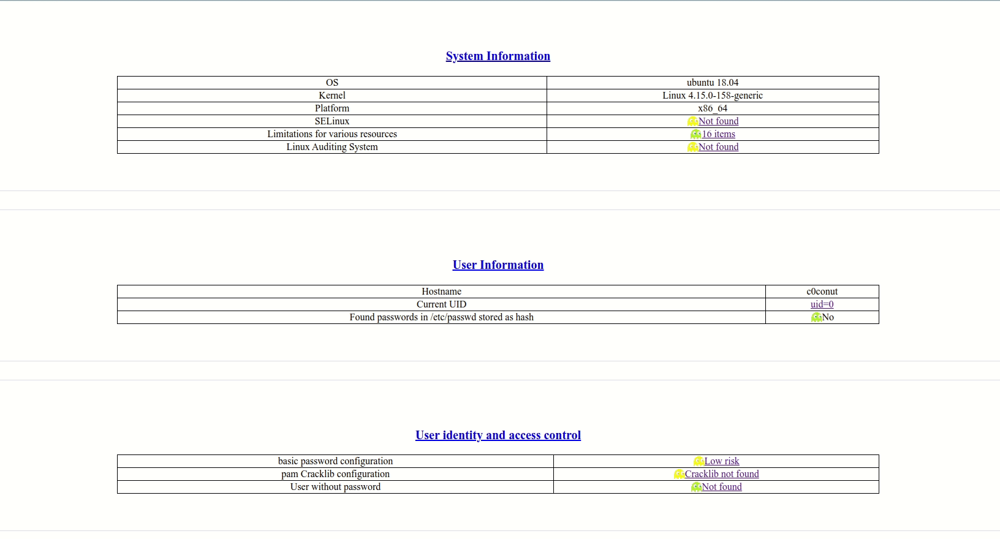
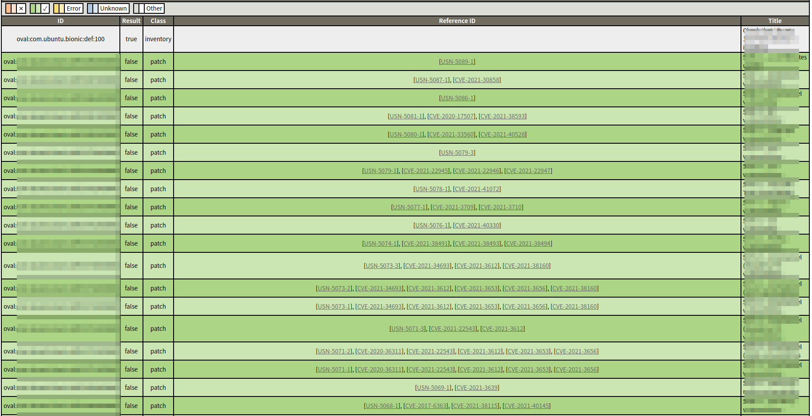
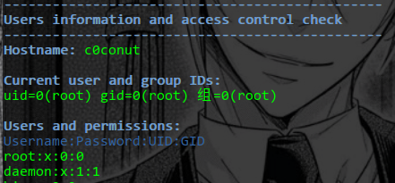
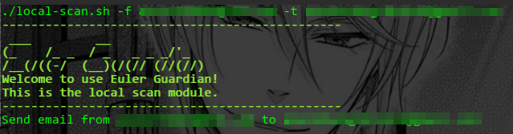
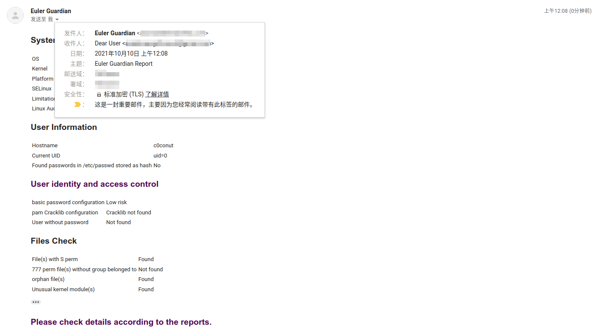
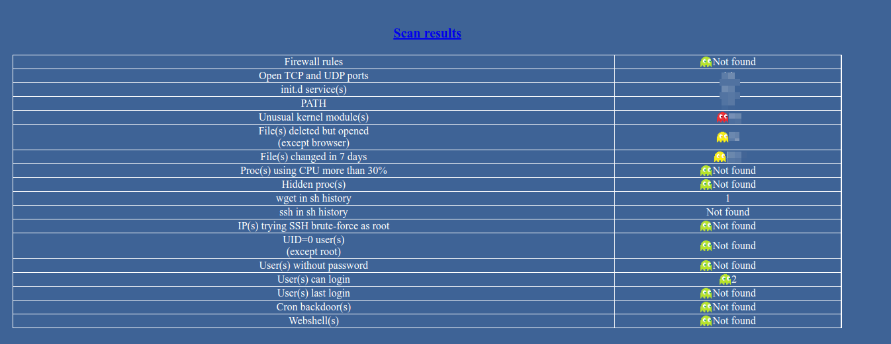
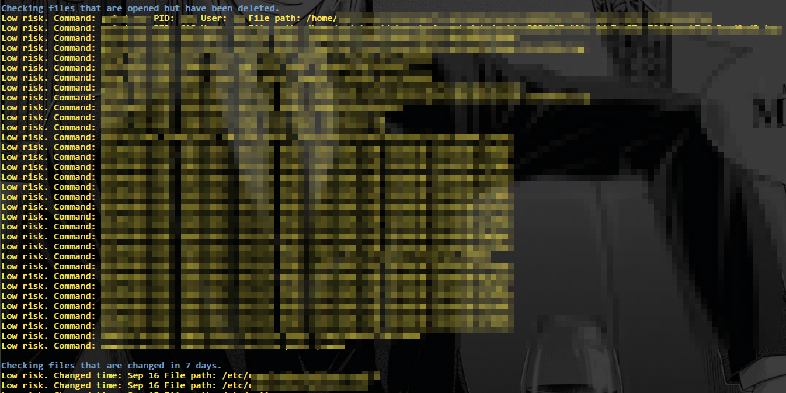
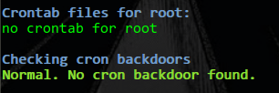

# Euler Guardian

Euler Guardian: 为openEuler社区开发的Linux操作系统通用风险评估工具

gitee 地址：
https://gitee.com/openeuler-competition/summer2021-110

<!-- vim-markdown-toc GFM -->

* [配置](#配置)
* [配色](#配色)
* [front end 前端](#front-end-前端)
* [模块说明](#模块说明)
	* [local scan 本地扫描模块](#local-scan-本地扫描模块)
		* [PreOp 预操作](#preop-预操作)
		* [SysInfoChk 系统信息检查](#sysinfochk-系统信息检查)
		* [SecCheck 安全策略检查](#seccheck-安全策略检查)
		* [UserInfoChk 用户信息检查](#userinfochk-用户信息检查)
		* [UserIdenChk 用户身份检查](#useridenchk-用户身份检查)
		* [FileChk 文件检查](#filechk-文件检查)
		* [AuditChk 操作系统安全审计](#auditchk-操作系统安全审计)
		* [OVALChk 软件包版本漏洞检查](#ovalchk-软件包版本漏洞检查)
		* [SendEmail 邮件预警](#sendemail-邮件预警)
	* [ER emergency response 应急响应模块](#er-emergency-response-应急响应模块)
		* [BasicCheck](#basiccheck)
		* [SensitiveFileCheck](#sensitivefilecheck)
		* [FilesChanged](#fileschanged)
		* [ProcAnalyse](#procanalyse)
		* [HiddenProc](#hiddenproc)
		* [HistoryCheck](#historycheck)
		* [UserAnalyse](#useranalyse)
		* [CronCheck](#croncheck)
		* [WebshellCheck](#webshellcheck)
* [Reference](#reference)

<!-- vim-markdown-toc -->

## 配置

首先，在使用前进行配置。

当您仅使用应急响应模块时，本配置并不必要。

1. 运行 config.sh

```bash
chmod +x config.sh
su
./config.sh
```

2. 配置 ssmtp

当您不使用邮件预警通知用户时，本配置并不必要。

```bash
vi /etc/ssmtp/ssmtp.conf # root privilidge is needed
```

依照以下示例，更改配置

```
root=username@gmail.com
mailhub=smtp.gmail.com:465
rewriteDomain=gmail.com
AuthUser=username
AuthPass=authcode
FromLineOverride=YES
UseTLS=YES
```

**注意：在发送邮件时，发件人地址需与此处填写地址相同**


## 配色

|color|info|
|---|---|
|blue| process display|
|default|information display|
|green|normal|
|yellow|low risk|
|red|high risk|
|purple|suggesion to repair|

## front end 前端

初始化CSS来自：

https://necolas.github.io/normalize.css/8.0.1/normalize.css

## 模块说明

### local scan 本地扫描模块

本模块需以root权限运行。运行完成后将生成报告。

```
Usage:
	-h	 help
	-f	 sender email addr
	-t	 receiver email addr
```

报告分为四部分：

1. 扫描结果汇总，表格形式，点击超链接跳转查看详细信息



2. 详细信息报告。所有扫描结果的详细信息。(有锚点)


3. Secure configuration 报告


4. CVE 报告



#### PreOp 预操作

1. 检查current id, 判断是否有root权限

2. 检查SetUID

3. 检查是否有之前检查留下的文件s.txt，若有，则删除

#### SysInfoChk 系统信息检查

检查系统信息。

#### SecCheck 安全策略检查

1. 检查是否开启了SELinux
2. 检查资源的限制情况


#### UserInfoChk 用户信息检查

检查用户信息。



1. 检查hostname
2. id
3. 检查口令是否以hash存储
4. 检查上一次登录的用户。

#### UserIdenChk 用户身份检查

口令配置（时效+复杂度）


1.口令有效期 PASS_MAX_DAYS

2.距上次更改口令后，最短多长时间可以再次更改 PASS_MIN_DAYS

3.口令最小长度 PASS_MIN_LEN

4.口令到期前多少天通知 PASS_WARN_AGE

5.口令已使用的时间

(to do)

2种计算方式

- 对于CentOS系，利用change`change -l [user]`

- `/etc/shadow`
https://blog.csdn.net/xiezuoyong/article/details/49890695

6.PAM的cracklib模块提供口令复杂度控制

**auth**类接口对用户身份进行识别认证

`pam_env.so`定义用户登录之后的环境变量

`pam_unix.so`提示用户输入口令，并与/etc/shadow进行对比

`pam_succeed_if.so`限制登录条件。在Linux系统中，一般系统用户的uid都在500之内，`uid >= 500 quiet`表示允许uid >= 500的用户登录，即使用useradd命令以及默认选项建立的普通用户直接由本地控制台登录系统。

`pam_deny.so`拒绝不匹配任何规则的登录

**password**接口确认用户使用的口令的合法性

|retry|difok|minlen|ucredit|lcredit|dcredit|dictpath|
|---|---|---|---|---|---|
|尝试次数|最少不同字符|最小口令长度|最少大写字母|最少小写字母|最少数字|密码字典路径|

7.空口令用户检查

#### FileChk 文件检查


1. 查找系统中所有含s权限的文件。

2. 查找无属组的777权限文件。

3. 查找孤儿文件。

4. 检查加载到内核的不常见module

#### AuditChk 操作系统安全审计

Linux Auditing System

对于CentOS系:需要audit, audit-libs

对于debian系:需要auditd

对于openEuler的安全加固(to do)

文档：

https://docs.openeuler.org/zh/docs/20.03_LTS/docs/SecHarden/%E6%93%8D%E4%BD%9C%E7%B3%BB%E7%BB%9F%E5%8A%A0%E5%9B%BA%E6%A6%82%E8%BF%B0.html

https://docs.openeuler.org/zh/docs/20.03_LTS/docs/SecHarden/%E5%AE%89%E5%85%A8%E5%8A%A0%E5%9B%BA%E5%B7%A5%E5%85%B7.html


#### OVALChk 软件包版本漏洞检查

利用OVAL和oscap，根据软件包版本检查是否存在CVE漏洞和安全配置。


基线库来自：

https://github.com/ComplianceAsCode/content

https://oval.cisecurity.org/repository/download

https://security-metadata.canonical.com

https://www.redhat.com/security/data/oval/v2/

#### SendEmail 邮件预警

发送邮件预警。







### ER emergency response 应急响应模块

使用场景: Linux受到入侵后的自动化快速应急响应。

可以选择是否生成HTML报告。


生成报告为表格形式



#### BasicCheck

基本检查


1. iptables防火墙规则

2. 开放的TCP, UDP端口

- systemd-resolve
systemd-resolve 是 Ubuntu 下 DNS 解析相关的命令，能使用它来操作 DNS 相关的功能。
- avahi
Zero configuration networking(zeroconf)零配置网络服务规范，是一种用于自动生成可用IP地址的网络技术，不需要额外的手动配置和专属的配置服务器。
Avahi 是Zeroconf规范的开源实现，常见使用在Linux上。包含了一整套多播DNS(multicastDNS)/DNS-SD网络服务的实现。

3. init.d services

4. `$PATH`

#### SensitiveFileCheck

敏感文件检查


1. 检查加载到内核的不常见module

tmpArr[]:

|0|1|2|
|---|---|---|
|Module|Size|Used by|

#### FilesChanged

被改变的文件检查



1. 文件打开，但是文件已被删除(除浏览器)

tmpArr[]

|0|1|2|3|4|5|6|7|8|9|
|---|---|---|---|---|---|---|---|---|---|
|COMMAND|PID|USER|FD|TYPE|DEVICE|SIZE/OFF|NLINK|NODE|NAME|


2. 文件改变时间检查

检查7天之内，指定目录下ctime改变

- atime: access time, 在读取文件或者执行文件时更改的
- ctime: change time, 在写入文件、更改所有者、权限或链接设置时随Inode内容更改而更改
- mtime：modify time, 写入文件时更改

#### ProcAnalyse

进程检查


检查proc使用CPU的百分比是否多于n%

#### HiddenProc

检查隐藏的process, 并按升序排序

#### HistoryCheck


1. 检查history中wget

2. 检查history中ssh

3. 检查是否有ssh的root用户口令爆破

#### UserAnalyse


1. 检查有root权限的用户是否为root

2. 检查空口令用户

3. 可登陆用户

4. 所有用户的上次登录情况

#### CronCheck



1. root的crontab files检查

2. cron后门检查

#### WebshellCheck


基于文件的webshell检查, 支持php asp jsp

## Reference

- [Lynis](https://cisofy.com/documentation/lynis/)
- [Vulmap](https://github.com/vulmon/Vulmap)
- [Nix Auditor](https://github.com/XalfiE/Nix-Auditor)
- [GScan](https://github.com/grayddq/GScan)
- wooyun: Linux服务器应急事件溯源报告
- 黑客入侵应急分析手工排查
- 安恒: 勒索病毒应急与响应手册
- 绿盟: 应急响应技术指南
- 等保2.0: GBT25070-2019信息安全技术网络安全等级保护安全设计技术要求
- Minimum Security Requirements for Multi-User Operating Systems
