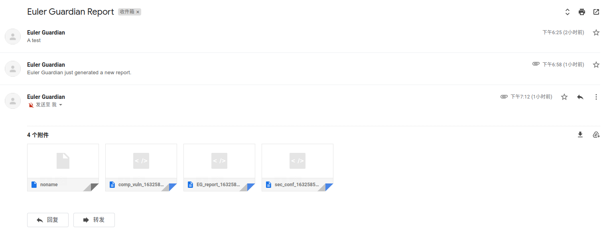
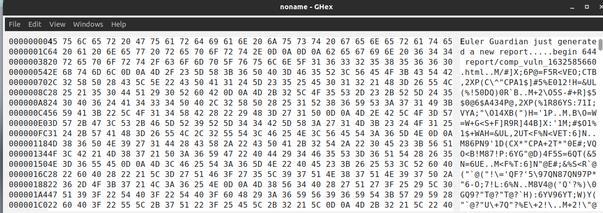
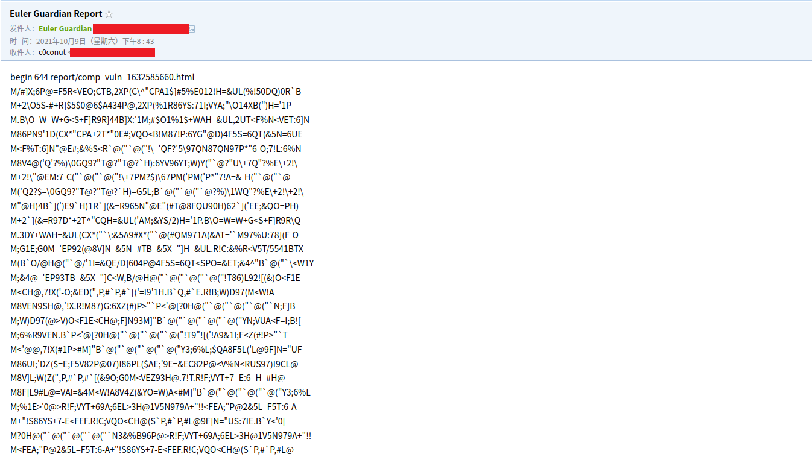

# local scan及ER关键技术文档

## 不依赖包管理器进行CVE检查

在开发OVALChk部分时，最初的想法是基于软件包管理器进行开发。例如，使用apt时，可以用apt list --installed来列出已经安装的软件包及其版本, 通过软件包版本检索其对应的CVE和是否patch。但存在一个问题，Linux发行版众多，使用不同的包管理器，例如yum, apt, snap等等。如果软件包版本漏洞匹配基于软件包管理器来做，将会非常繁琐。

OVAL，Open Vulnerability Assessment Language，即开放式漏洞评估语言。OVAL由MITRE公司开发，是一种用来定义检查项、脆弱点等技术细节的一种描述语言。OVAL同样使用标准的XML格式组织其内容。它提供了足够的灵活性，可以用于分析Windows、Linux、Unix以及各种嵌入式操作系统的系统状态、漏洞、配置、补丁等情况，而且还能用于描述测试报告。OVAL能够清晰地对与安全相关的检查点作出描述，并且这种描述是机器可读的，能够直接应用到自动化的安全扫描中。非常适合本项目的应用场景，所以最终使用OVAL进行基于软件包版本的漏洞检查。

现存在的SSG基线库中，以Redhat所维护的最为全面。CentOS、ubuntu等也有自己的OVAL文件。所以，在基线库的选择问题上，应当先匹配是否有本操作系统本版本的对应文件，若有，则直接检查，若无，再使用通用基线库进行检查。

## 邮件预警和buggy SMTP client

邮件预警功能使用SMTP协议

最初的实现如下。我最初的想法是，直接将reports以attachments的形式发送给用户。但是，用户使用什么SMTP client接收是未可知的，虽然名义上都使用相同的协议，但各公司的client实现却不同。

```bash
(
cat - <<END
To: Dear User<${toAddr}>
From: Euler Guardian<${fromAddr}>
Subject: Euler Guardian Report
Content-Type: text/plain

END
# generate uuencoded attachments
for attachment in $attachments ; do
  uuencode $attachment $attachment
done
) | sendmail -t
```

经过`uuencode $attachment $attachment`后的数据格式应当是如下所示：

```
begin [num] [filename]
[ciphertext]
end
```

若有多个attachments,则是

```
begin [num] [filename]
[ciphertext]
end
begin [num] [filename]
[ciphertext]
end
begin
...
end
```

不同的SMTP client对它的处理方式不同。

如gmail, 能够顺利还原出每一个attachment,但是同时会把整个uuencoded raw data作为一个noname attachment



如果是在发送邮件的body中有string, noname则会把这个string也包含进去，为从content到所有的uuencoded attachments的raw data



如qq邮箱，无法从uuencoded attachments中还原出原有的attachments, 加密过的attachments raw data全部显示在正文中，并不显示有附件。



如果正文有string，则


鉴于各个client的实现不同，改直接发送reports作为attachments为发送charts。
