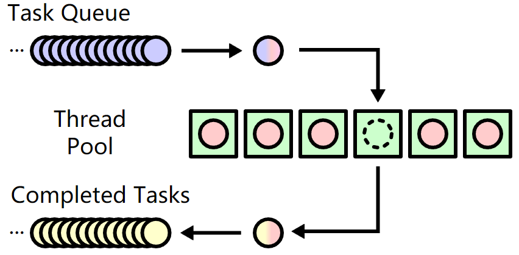

# netscan 关键技术点文档

## port scan 线程池

以TCP握手为例，分为三种情况

1. 正常三次握手 `conn`

2. 端口关闭 `err != nill`

3. 有防火墙 -> timeout (20s)

基本想法: 遍历每个端口，`net.Dial()`进行扫描。但是若出现timeout, 则需要很长时间。

多线程：为每一个`ip:port`创建一个线程，则总扫描时间取决于单独的进程（即，timeout的20s左右）。

线程池 worker pool：

go中使用的是goroutine 而不是thread, 但本质差不多。thread/goroutine -> worker

当有new task时，检查是否有空闲的worker,若有，直接处理。若没有，把task加入task queue.

Go lang中有mutex和channel两种实现worker pool的方式。
